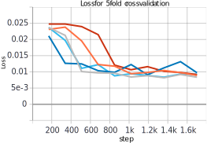
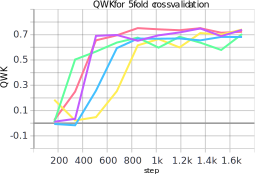
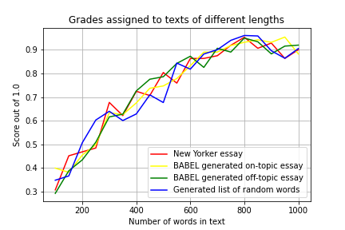

## What Does a Deep Learning Automated Essay Scoring System Know About Good Essays
Course project from [CS 396/496 Deep Learning](https://interactiveaudiolab.github.io/teaching/deeplearning.html#top) taught by Professor [Bryan Pardo](https://users.cs.northwestern.edu/~pardo/) at Northwestern University, Fall 2020.

### Team members:

- Nicole Hessler ([nicolehessler2021@u.northwestern.edu](nicolehessler2021@u.northwestern.edu))
- Yihong Hu ([yihonghu2021@u.northwestern.edu](yihonghu2021@u.northwestern.edu))
- Evey Huang ([eveyhuang@u.northwestern.edu](eveyhuang@u.northwestern.edu))

### Project Overview
Essay writing has been a key part of the student assessment process in standardized exams such as the SAT and GRE. Millions of students across the world take such exams each year, resulting in a huge burden for human graders to grade such a high volume of writing efficiently and consistently. With recent advancement in neural networks and natural language processing, there is a possibility to scale up human graders’ ability and reduce the amount of time needed to grade large numbers of essays in standardized tests and eliminate human bias caused by raters’ expertise and inconsistency.

In our project, we replicated a neural model for automated essay scoring [(Taghipour & Ng, 2016)](https://www.aclweb.org/anthology/D16-1193.pdf), using the [Automated Student Assessment Prize (ASAP) dataset](https://www.kaggle.com/c/asap-aes) released on Kaggle, evaluated with 5-fold cross validation, and tested how the model performs on data it has not seen before.

Our network contains a lookup table, an optional convolution layer, a recurrent layer with LSTM units, and finally a fully connected layer with a sigmoid activation. For evaluation, we used the quadratic weighted kappa (QWK) as the metric. This metric measures the correlation of agreements between human raters and the model and is adopted as the official metric by ASAP. A QWK score closer to 1 means a higher agreements between the human and machine (indicating that the model is producing scores similar to those of human raters). We then ran 5-fold evaluation to measure the performance of the model. The result is shown in the two graphs below (one for loss, and one for QWK ).

Loss          |  QWK
:-------------------------:|:-------------------------:
  |  

To test whether our model is actually learning anything about good essays, we tested it with (a) [an Essay published on New Yorker](https://www.newyorker.com/business/currency/are-computers-making-society-more-unequal
), (b) two essays generated by Babel (one on the same topic as the training data, one on different topics), (c) a random list of words. We took subsections of each essay with lengths ranging from 100 to 1000 words to see if the scores vary by length. As shown in the graph below, the model's prediction increases as the length of the essays increases.

Though we were able to replicate the model, train it with the same tuning parameters and number of steps, and reach a similar QWK score to the one obtained by the authors, our model did not necessarily learn about what constitutes a good essay. The fact that the model would give a random list of words a high score as long as the length is over the average also made us suspect that the model did not learn about the context, or grammar, or overall structure. Compared to other AES approaches with heavy feature engineering (such as coherence, clarity, or grammar), our approach of directly feeding in the tokenized text to the model resulted in a model that evaluates essays as merely lists of words. The model did not learn about what makes good writing, but only memorized what were the differences in vocabularies between the good and bad essays within the prompt 1 essays from ASAP dataset.

### In case you are interested in knowing more...
You can check out our final paper here
