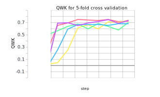

## What Does a Deep Learning Automated Essay Scoring System Know About Good Essays
Course project from [CS 396/496 Deep Learning](https://interactiveaudiolab.github.io/teaching/deeplearning.html#top) taught by Professor [Bryan Pardo](https://users.cs.northwestern.edu/~pardo/) at Northwestern University, Fall 2020.

### Team members:

- Nicole Hessler
- Yihong Hu
- Evey Huang ([eveyhuang@u.northwestern.edu](eveyhuang@u.northwestern.edu))

### Details
Essay writing has been a key part of the student assessment process in standardized exams such as the SAT and GRE. Millions of students across the world take such exams each year, resulting in a huge burden for human graders to grade such a high volume of writing efficiently and consistently. With recent advancement in neural networks and natural language processing, there is a possibility to scale up human graders’ ability and reduce the amount of time needed to grade large numbers of essays in standardized tests and eliminate human bias caused by raters’ expertise and inconsistency.

In our project, we replicated a neural model for automated essay scoring [(Taghipour & Ng, 2016)](https://www.aclweb.org/anthology/D16-1193.pdf), using the [Automated Student Assessment Prize (ASAP) dataset](https://www.kaggle.com/c/asap-aes) released on Kaggle, evaluated with 5-fold cross validation, and tested how the model performs on data it has not seen before.

Our network contains a lookup table, an optional convolution layer, a recurrent layer with LSTM units, and finally a fully connected layer with a sigmoid activation. For evaluation, we used the quadratic weighted kappa (QWK) as the metric. This metric measures the correlation of agreements between human raters and the model and is adopted as the official metric by ASAP. A QWK score closer to 1 means a higher agreements between the human and machine (indicating that the model is producing scores similar to those of human raters). We then ran 5-fold evaluation to measure the performance of the model. The result is shown in the two graphs below (one for loss, and one for QWK scores).

